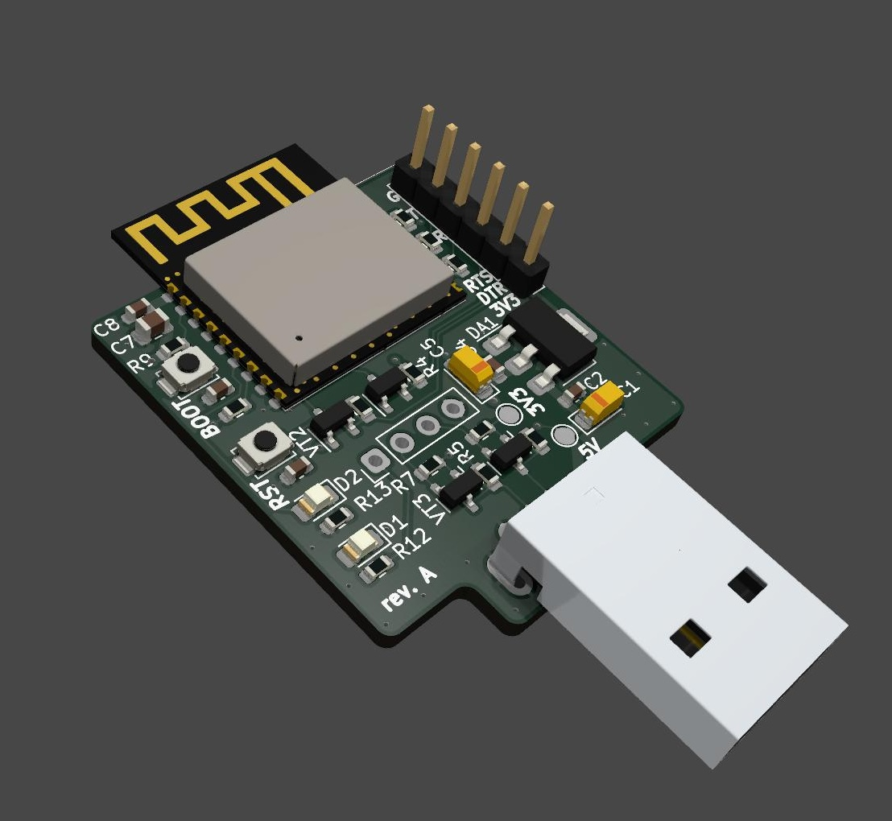

# Haire Module

KiCad Remote Control module project for Haier air conditioner.

Based on Espressif [ESP32-C3-WROOM-02](https://www.espressif.com/sites/default/files/documentation/esp32-c3-wroom-02_datasheet_en.pdf)

[Telegram bot based firmware](https://github.com/memric/HaierModuleFirmware) can be used.
